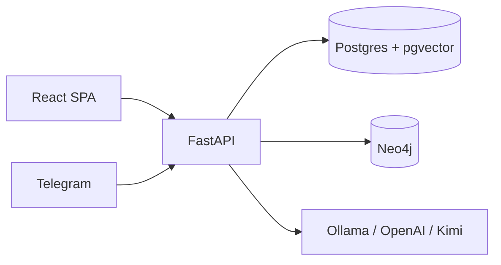

# Sahayak — AI Public Service Assistant

**Build for Billions, Track 3: Reinvent Digital Public Infrastructure** (hackathon prototype)

demo video : https://drive.google.com/drive/folders/1A2NG4HCF-IHKF5JuMgzPjPdqgxFkIKnT?usp=sharing

Sahayak is a multilingual AI assistant for public services. A citizen describes a life event (“Heavy rain destroyed my crop”). Sahayak finds relevant government schemes, explains eligibility and required documents, and shows the official evidence behind every claim. It then sits beside the citizen on a mock application form: it reads the screen, answers by voice or text, fills fields, and keeps AI notes plus the citizen’s own notes.

> **Demo mode.** Seed “official” documents are plain-language summaries marked **DEMO**. The government form, submission, and status updates are mocks. Nothing is sent to any government portal.

**Documentation**

| Document | What it covers |
|---|---|
| [docs/ARCHITECTURE.md](docs/ARCHITECTURE.md) | System design, data stores, KAG pipeline, ingestion, form assistance, bots |
| [docs/API.md](docs/API.md) | REST API: auth, schemes, assistant, applications, admin, health |
| [docs/FORM_ASSISTANT.md](docs/FORM_ASSISTANT.md) | AI Form Assistant: upload any form, detect fields, AutoFill, completed PDF |
| [TELEGRAM_SETUP.md](TELEGRAM_SETUP.md) | End-to-end Telegram bot setup |
| [WHATSAPP_SETUP.md](WHATSAPP_SETUP.md) | End-to-end WhatsApp bot setup (Meta Cloud API) |
| [DEPLOYMENT.md](DEPLOYMENT.md) | Production topology, scaling, rate limits, TLS, backups |
| [sentry.md](sentry.md) | Step-by-step guide to the optional Sentry dashboard |
| [whisper-chat-app/README.md](whisper-chat-app/README.md) | Optional offline mobile app: on-device whisper speech-to-text + Gemma 4 answers over the bundled data |

---

## Features

- **Life-event discovery** — English, Hindi, and Kannada (script detection + translation for retrieval).
- **Knowledge-augmented generation (KAG)** — Neo4j scheme graph + pgvector document chunks; citations are validated in the backend, not trusted from the LLM.
- **Screen-aware form help** — structured screen context, plus a vision model or Tesseract OCR fallback to read shared tabs (frames are never stored). Values are filled only after the citizen approves them.
- **AI Form Assistant** — upload any PDF or photo of a form (no prebuilt forms). It reads the page (PyMuPDF, OpenCV, Tesseract), detects fields, asks for what is missing, clarifies ambiguity, and writes a completed PDF onto a copy. The original is never modified; every file and row is private to its owner.
- **Citizen wallet** — documents, notes, application tracker with a mock status timeline.
- **Admin knowledge ops** — upload PDFs/HTML/MD/DOCX, fetch URLs, watch ingestion stages, inspect chunks, add schemes.
- **Telegram and WhatsApp bots** — same KAG pipeline (Telegram long-polls in the FastAPI process; WhatsApp uses a webhook). Both optional.
- **Offline mobile app** — `whisper-chat-app/` runs whisper, a small embedder and Gemma 4 E2B on the phone and answers from bundled data with no network after the first launch.
- **Pluggable AI** — Ollama (default), OpenAI, or Kimi; labelled fallback when models are still downloading.



Full diagrams and a written walkthrough: [docs/ARCHITECTURE.md](docs/ARCHITECTURE.md).

---

## Quick start (Docker Compose)

```bash
cp backend/.env.example backend/.env      # optional: OpenAI / Kimi, models, Telegram token
docker compose up --build
```

| Service | URL |
|---|---|
| App (citizen + admin) | http://localhost:5173 |
| API (OpenAPI) | http://localhost:8000/docs |
| Neo4j Browser | http://localhost:7474 (`neo4j` / `password`) |
| Ollama | http://localhost:11434 |

The `ollama-pull` service pulls models named in `backend/.env` (`EMBEDDING_MODEL`, `LLM_MODEL`, and `VISION_MODEL` if set). Until they are ready, the app uses a clearly labelled fallback (deterministic answers + lexical embeddings). Status is in **Admin → Overview → AI system** and `GET /api/health/ai`. When the embedding model appears, chunks are re-embedded automatically.

To pull models by hand:

```bash
docker compose exec ollama ollama pull nomic-embed-text
docker compose exec ollama ollama pull qwen3:8b
# optional, for screenshot understanding:
docker compose exec ollama ollama pull qwen2.5vl:7b   # then set VISION_MODEL=qwen2.5vl:7b
```

Ollama on the host instead of Compose: `OLLAMA_BASE_URL=http://host.docker.internal:11434`.

### Demo accounts

| Role | Email | Password |
|---|---|---|
| Citizen (farmer, Mandya) | `ramesh@demo.in` | `Demo@123` |
| Admin | `admin@demo.gov.in` | `Admin@123` |

The sign-in page has one-click buttons for both.

---

## Demo script (short)

**Citizen:** Sign in as Ramesh → **Talk to Assistant** → “Heavy rain destroyed my crop.” Open **Sources used** and **How this answer was grounded**. Ask “Why did you tell me this?” Apply to *Crop Damage Assistance* → **Help Me Fill This Form** → share the tab. Speak naturally (`yes`, `What should I put here?`, `Aadhaar`, skip, IFSC, land size). The assistant never ticks the declaration. Review, confirm, submit (demo). Use **Simulate status update** on the tracker.

**Admin:** Overview stats and pipeline → **Knowledge Base → Upload document** (e.g. `data/documents/crop-damage-field-survey-advisory-DEMO.md`) → watch Uploaded → … → Complete. Playground query should cite the new chunks. **Sources → Fetch & index** for a URL. **Schemes** shows the Neo4j neighbourhood; **Users** for roles and disable.

A step-by-step walkthrough lives in [docs/ARCHITECTURE.md](docs/ARCHITECTURE.md#13-citizen-and-admin-journeys).

---

## Project layout

```
backend/app/
  main.py, config.py     FastAPI app, pydantic-settings (.env)
  api/                   REST routers
  auth/                  bcrypt, JWT, USER / ADMIN deps
  models/, schemas/      SQLAlchemy + Pydantic
  database/              Postgres + pgvector
  graph/store.py         Neo4j (+ in-memory fallback)
  ingestion/             extract, chunk, embed, index, web fetch
  monitoring.py          optional Sentry error and performance monitoring, PII-scrubbed
  kag/                   understand → retrieve → generate → validate citations
  services/              AI providers, form assistant, seed, notes
  services/formdoc/      AI Form Assistant: storage, validation, analysis, detection, fill, assistant
  bot/                   Telegram and WhatsApp handlers, keyboards, formatter
backend/tests/           pytest suite for the form assistant (SQLite, no containers)
data/seed/               graph.json, DEMO documents, form JSON
data/documents/          extra files for the admin upload demo
frontend/src/            React + Vite + Tailwind (citizen + admin); monitoring.ts is the optional Sentry setup
whisper-chat-app/        Expo offline assistant: whisper + Gemma 4 RAG (needs a native dev build)
scheme/                  Scraped scheme library, synced into the knowledge base (SCHEME_DIR)
docs/                    Architecture, API reference and form assistant notes
```

---

## Local development without Docker

Postgres 16 with pgvector is required. Neo4j and Ollama are optional (in-memory graph and AI fallback exist).

```bash
cd backend && cp .env.example .env
# DATABASE_URL=...@localhost..., NEO4J_URI=bolt://localhost:7687
# OLLAMA_BASE_URL=http://localhost:11434, SEED_DIR=../data/seed
python -m venv .venv && . .venv/bin/activate && pip install -r requirements.txt
uvicorn app.main:app --reload

cd ../frontend && npm install && npm run dev
# http://localhost:5173  (Vite proxies /api → :8000)
```

---

## Configuration

Copy `backend/.env.example`. Important variables:

| Variable | Purpose |
|---|---|
| `LLM_PROVIDER` | `ollama` \| `openai` \| `kimi` |
| `LLM_MODEL` / `EMBEDDING_MODEL` / `VISION_MODEL` | Generation, vectors, optional screen vision |
| `OCR_ENABLED` / `TESSERACT_CMD` | Tesseract fallback for screen reading when no vision model (Docker image includes it) |
| `DATABASE_URL`, `VECTOR_BACKEND` | Postgres; vectors in `chroma` (default), `pgvector`, or `json` cosine fallback |
| `SENTRY_DSN` and friends | Optional Sentry monitoring, off while the DSN is empty. Frontend: `FRONTEND_SENTRY_DSN` build arg. See [Monitoring with Sentry](#monitoring-with-sentry-optional) |
| `CHROMA_DIR` / `CHROMA_HOST` | Embedded Chroma path, or a shared Chroma server for multi-replica deploys |
| `SCHEME_DIR` / `SCHEME_AUTO_SYNC` | Scheme library folder ingested into the knowledge base |
| `NEO4J_*` | Graph; unreachable Neo4j → in-memory store |
| `JWT_SECRET_KEY` | Change outside local demo (the backend refuses the default when `APP_ENV=production`) |
| `FORMS_DIR`, `MAX_FORM_SIZE_MB`, `MAX_FORM_PAGES` | Private storage and limits for the AI Form Assistant |
| `TELEGRAM_BOT_TOKEN` | Empty disables the bot |
| `WHATSAPP_TOKEN`, `WHATSAPP_PHONE_NUMBER_ID`, `WHATSAPP_VERIFY_TOKEN`, `WHATSAPP_APP_SECRET` | WhatsApp Cloud API bot (webhook at `/api/webhooks/whatsapp`); empty token disables it |
| `DEMO_MODE` | Mock submit / status; forgot-password returns the reset token |
| `REDIS_URL`, `RATE_LIMIT_*` | Rate limits (`count/period:burst`); Redis shares them across replicas |
| `RUN_BACKGROUND_TASKS` | Run the Telegram bot and re-embed loop here; exactly one container in production |

API keys are never returned by the API. Interactive OpenAPI: `/docs` (disabled when `APP_ENV=production`).

---

## Monitoring with Sentry (optional)

Crash and error reporting for both the API and the browser. It is **off unless you set a DSN**: with the DSN empty the backend never imports the SDK, and the frontend does not even download it.

For a step-by-step walkthrough of getting the dashboard (accounts, projects, DSNs, verifying, reading it, alerts, troubleshooting), see **[sentry.md](sentry.md)**.

**Turn it on**

1. In Sentry, create two projects: a **Python** one (backend) and a **Browser** one (frontend). Each has its own DSN.
2. Backend: put the Python DSN in `SENTRY_DSN` (`backend/.env` for Docker Compose and local development, `.env.prod` in production).
3. Frontend: put the Browser DSN in `FRONTEND_SENTRY_DSN` (root `.env` for Docker Compose, `.env.prod` in production). For `npm run dev` outside Docker use `VITE_SENTRY_DSN` in `frontend/.env` (see `frontend/.env.example`).
4. The frontend DSN is baked into the bundle at build time, so **rebuild the frontend** after changing it. Restart the backend after changing its settings.
5. Check the backend log for `Sentry enabled (env=..., traces=...)`.

| Variable | Where | Meaning |
|---|---|---|
| `SENTRY_DSN` | backend | Python project DSN. Empty disables Sentry |
| `SENTRY_ENVIRONMENT` | backend | Defaults to `APP_ENV`; the production compose file sets `production` |
| `SENTRY_RELEASE` / `RELEASE` | backend, build | Deployed version (git SHA) so errors are tied to a release. In production set `RELEASE` in `.env.prod`; it feeds both the backend and the frontend build |
| `SENTRY_SERVER_NAME` | backend | Tells replicas apart; defaults to the container hostname |
| `SENTRY_TRACES_SAMPLE_RATE` | backend, build | Fraction of requests traced. Default `0.05` in development, `0.02` in production. Keep it low: cost grows with traffic |
| `SENTRY_PROFILES_SAMPLE_RATE` | backend | Profiling, `0.0` (off) by default |
| `FRONTEND_SENTRY_DSN` | Compose build arg | Browser project DSN, passed to Vite as `VITE_SENTRY_DSN`. Empty ships the frontend without Sentry |
| `VITE_SENTRY_ENVIRONMENT` / `VITE_SENTRY_RELEASE` / `VITE_SENTRY_TRACES_SAMPLE_RATE` | frontend build | Same meanings for the browser; set by the compose files, or in `frontend/.env` for local development |

**What it reports.** Unhandled exceptions and `log.exception()` calls in the API, server-side (5xx) API failures, and browser crashes (a React error boundary catches render errors). Expected client mistakes (4xx, rate limits), offline or aborted requests and browser-extension noise are ignored. One request is one trace across browser and API: the browser makes the sampling decision and the API follows it; health checks are never traced.

**What it never sends.** This app handles identity documents, so it is built not to leak them:

- No request or response bodies, headers, cookies or query strings, and no stack-frame local variables. URLs are cut at the `?`.
- Aadhaar-style numbers, phone numbers, email addresses and bearer tokens are redacted from messages and breadcrumbs, in both the API and the browser (`backend/app/monitoring.py`, `frontend/src/monitoring.ts`).
- A signed-in user is identified by an opaque id and role only. No session replay, and clicks and console output are not recorded.

---

## Production deployment

`docker-compose.prod.yml` runs a multi-container deployment: an nginx edge proxy, several API replicas, a single background worker, Redis for shared rate limits, and databases on a private network. See [DEPLOYMENT.md](DEPLOYMENT.md) for setup, scaling, rate limits, TLS and backups.

---

## Security and privacy (prototype)

- Passwords hashed with bcrypt; JWT on protected routes; admin routes require `ADMIN`.
- Uploads checked by type and size. Disabled accounts cannot sign in.
- Requests are rate-limited per user (GCRA, shared through Redis in production), with stricter limits on sign-in and AI endpoints. See [DEPLOYMENT.md](DEPLOYMENT.md#rate-limiting).
- Screen frames are not stored and are sent only with questions. Aadhaar and account numbers are masked to the last 4 digits, and OTP/PIN/password values are redacted, before messages are stored (web assistant, form assistant, Telegram).
- Forgot-password surfaces the reset token only when `DEMO_MODE` is true (no email service).
- Optional Sentry monitoring never receives request bodies, headers, cookies, query strings or local variables, and redacts ID numbers, phones, emails and tokens ([details](#monitoring-with-sentry-optional)).
- Intentionally out of scope: SSO, rich RBAC, queues, dashboards, metrics and alerting.

---

## Knowledge sources

Seed documents summarise publicly described features of crop-loss disaster relief (SDRF/NDRF input subsidy), PMFBY, PM-KISAN, and Kisan Credit Card calamity relief. Each is `is_demo: true` and links only to the root of an official portal. Rules change; the assistant tells users to confirm on the portal. In a real deployment, admins load official PDFs and pages through **Knowledge Base** and **Sources**.
