# Sahayak architecture

How the Build for Billions prototype is put together: processes, data stores, knowledge-augmented generation (KAG), ingestion, form assistance, and Telegram.

Companion docs: [README](../README.md), [API](API.md), [Telegram setup](../TELEGRAM_SETUP.md), [WhatsApp setup](../WHATSAPP_SETUP.md).

---

## Full architecture (text)

Sahayak is a **single-product stack** with three user-facing surfaces and one backend process.

**Surfaces.** (1) A React SPA at port 5173 for citizens and admins. (2) A Telegram bot that long-polls from inside the FastAPI process. (3) An optional Expo **Whisper Chat** app: a fully on-device assistant (whisper speech-to-text, MiniLM search, Gemma 4 answers) that is **not** connected to the API.

**Backend.** One FastAPI app (`backend/app/main.py`) on port 8000. It owns REST (`/api/*`), JWT auth, seeding, background re-embed, and (if `TELEGRAM_BOT_TOKEN` is set) Telegram polling. There is no separate worker queue and no Celery. Ingestion jobs run as FastAPI `BackgroundTasks` in the same process.

**Stores.** PostgreSQL 16 with pgvector holds users, applications, wallet files metadata, notes, conversations/messages, knowledge documents, chunks (including embeddings), and ingestion jobs. Neo4j 5 holds the **scheme graph**: life events, schemes, eligibility rules, document requirements, departments, states, portals, and document/source nodes. If Neo4j is unreachable, an in-memory graph with the same interface is used so the demo still runs.

**AI.** Callers never talk to a vendor SDK directly. They use `get_ai()` (`generate`, `generate_json`, `embed`). Implementations are Ollama (default), OpenAI, or Kimi. Optional `VISION_MODEL` reads a downscaled JPEG of the shared form tab; frames are never stored. If models are still downloading, a labelled **fallback** composes answers from retrieved text and uses lexical embeddings.

**The product loop.** A citizen describes a life event. **KAG** detects language (en/hi/kn), intent, and life event; pulls matching schemes and rules from Neo4j; pulls evidence chunks via vector cosine **and** Postgres full-text; fuses ranks; sends only those facts to the LLM; then **strips any citation IDs the LLM invented**. The citizen can start a mock application. A **form assistant** receives structured screen context (and optional vision), fills fields through validators, cites form-guide chunks, regenerates AI notes, and never ticks the declaration. Submit is a demo write to Postgres with a fake reference number. Admins prove the system is not hard-coded by uploading PDFs or fetching URLs; those documents go through extract → chunk → embed → index and then appear in later citizen answers.

**Auth.** bcrypt passwords, HS256 JWTs, roles `USER` and `ADMIN`. Admin routes are gated at the router. Telegram users are keyed by `telegram_id` with no password. Demo forgot-password returns the reset token in JSON because there is no mailer.

That is the entire system: SPA + Telegram → FastAPI → Postgres/pgvector + Neo4j + pluggable LLM, with KAG as the retrieval contract and a mock form/tracker for the hackathon demo.

---

## 1. What the system is for

Sahayak takes a citizen from a **life event** (for example crop damage) to:

1. Relevant **schemes** and eligibility facts in the graph.
2. **Evidence chunks** from indexed documents (publisher, section, URL, content hash).
3. A **mock application** filled with a screen-aware assistant.
4. A **tracker** of that application (demo status only).

Admins prove knowledge is not hard-coded: they upload or fetch sources, watch ingestion, and see new evidence in citizen answers.

The prototype is **demo-first**. Seed documents are `is_demo`. Submissions never leave this stack.

---

## 2. Runtime topology

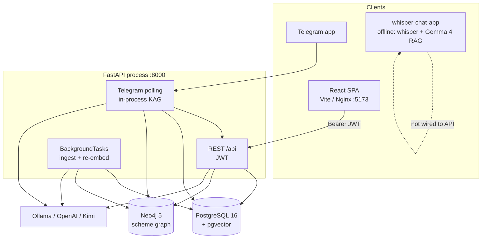

Compose services: `postgres`, `neo4j`, `ollama`, one-shot `ollama-pull`, `backend`, `frontend`.

The Telegram bot does **not** HTTP-call its own API. Handlers invoke KAG in-process (`asyncio.to_thread` around the sync pipeline).

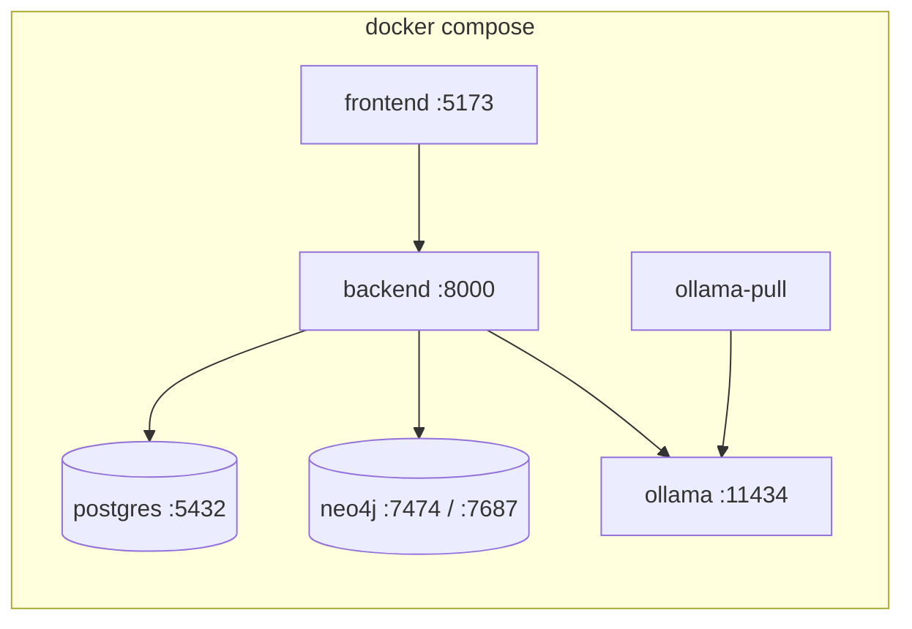

### Production topology (`docker-compose.prod.yml`)

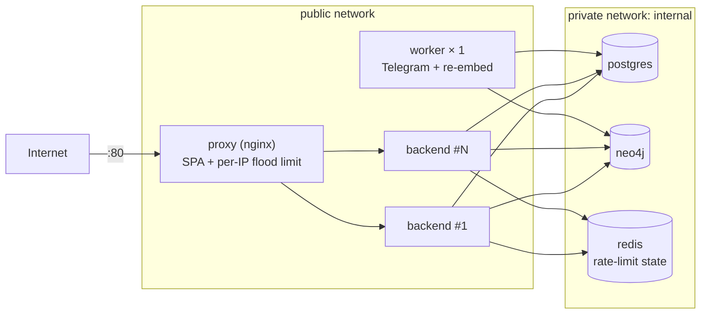

API replicas run with `RUN_BACKGROUND_TASKS=false`. The single `worker` runs the Telegram poller and the re-embed loop. Startup schema setup and seeding take a Postgres advisory lock, so replicas start concurrently without racing. Requests are rate-limited in two layers: per IP at nginx, and per user in the API with GCRA, whose state is shared through Redis. Details are in [DEPLOYMENT.md](../DEPLOYMENT.md).

---

## 3. Frontend

| Piece | Role |
|---|---|
| React 18 + TypeScript + Vite + Tailwind | SPA |
| `src/App.tsx` | Routes: guest auth, citizen layout, admin layout |
| `src/services/api.ts` | `fetch` to `/api`, JWT in `localStorage` (`sahayak.token`) |
| `src/services/auth.tsx` | Session from `GET /api/auth/me` |
| `src/i18n` | en / hi / kn |
| `useSpeech`, `VoiceButton` | Browser speech for the assistant |
| `useScreenCapture` | Tab share; structured fields + optional JPEG frame |

Vite proxies `/api` to `http://localhost:8000` in development. Production frontend is Nginx + `/api` reverse proxy.

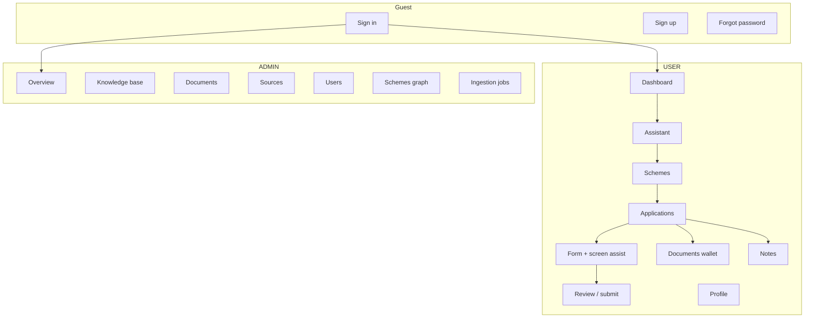

---

## 4. Backend application

Entry: `backend/app/main.py`. Settings: `backend/app/config.py` (pydantic-settings, `backend/.env`).

**Startup (lifespan):**

1. Postgres extensions, `create_all`, light migrations (for example `telegram_id`).
2. Seed graph, documents, demo users, form templates from `SEED_DIR`.
3. Loop that re-embeds chunks when a real embedding model appears.
4. Start Telegram polling if `TELEGRAM_BOT_TOKEN` is set.

```mermaid
flowchart LR
  subgraph api_pkg [api]
    auth[auth / users]
    sch[schemes]
    asst[assistant / kag]
    apps[applications]
    notes[notes]
    docs[documents]
    scr[screen-assistance]
    adm[admin]
    hl[health]
  end

  subgraph core [core]
    kag[kag]
    ing[ingestion]
    graph[graph store]
    form[form_assistant]
    aip[ai providers]
    bot[bot]
  end

  asst --> kag
  adm --> ing
  sch --> graph
  kag --> graph
  kag --> aip
  scr --> form
  form --> kag
  bot --> kag
```

Routers: see [API.md](API.md).

---

## 5. Data model

### 5.1 PostgreSQL

`VECTOR_BACKEND=chroma` (default) keeps chunk text and metadata in Postgres and the vectors in a ChromaDB collection keyed by chunk id (embedded under `CHROMA_DIR`, or a server via `CHROMA_HOST`). `pgvector` uses `vector(EMBEDDING_DIM)`. `json` stores vectors as JSON and scores cosine in Python. Keyword search always runs on Postgres full-text search.

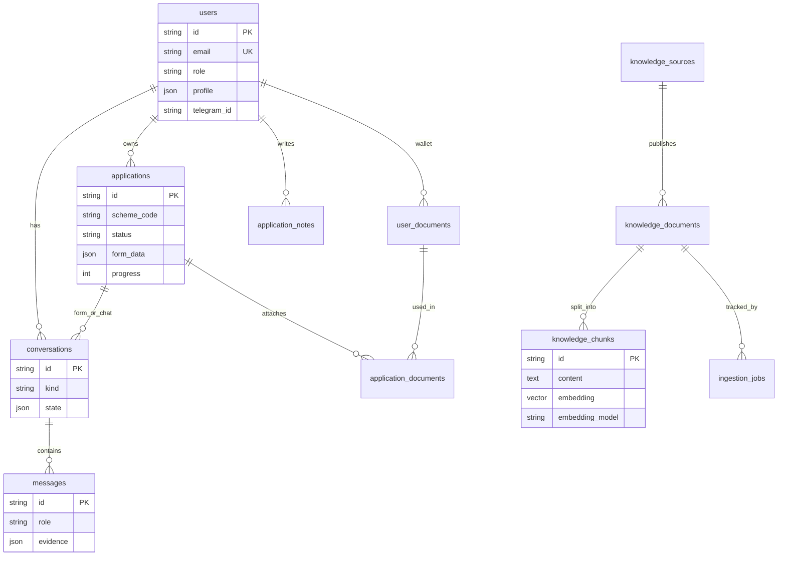

| Table | Purpose |
|---|---|
| `users` | Email, bcrypt, `USER` \| `ADMIN`, profile JSON, language, optional `telegram_id` |
| `conversations` / `messages` | Assistant chat and form sessions; `evidence` + `meta` on messages |
| `applications` | `form_data`, `field_status`, `progress`, `timeline`, `evidence` |
| `user_documents` | Citizen wallet files |
| `application_documents` | Wallet items on an application |
| `application_notes` | `USER` (editable) vs `AI` (regenerated) |
| `knowledge_sources` | Publisher / site |
| `knowledge_documents` | Upload, web, or seed; status, hash, scheme codes |
| `knowledge_chunks` | Text + section/page + embedding + `embedding_model` |
| `ingestion_jobs` | Stage timeline |

### 5.2 Neo4j (scheme graph)

`backend/app/graph/store.py`. Seed: `data/seed/graph.json`. Unreachable Neo4j → `MemoryGraph`. Health reports `graph_backend`: `neo4j` or `memory`.

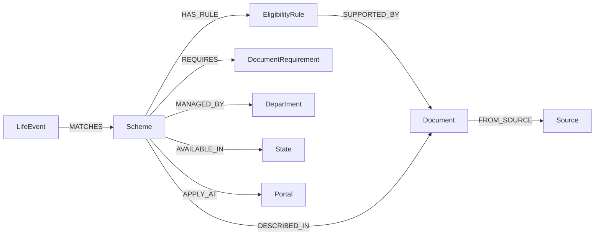

---

## 6. Knowledge-augmented generation (not plain RAG)

Code: `backend/app/kag/`.

The LLM is the **interpreter**, not the authority. It only sees retrieved graph facts and chunks, must emit citation IDs, and the backend **drops unknown IDs** and **attaches source metadata itself**.

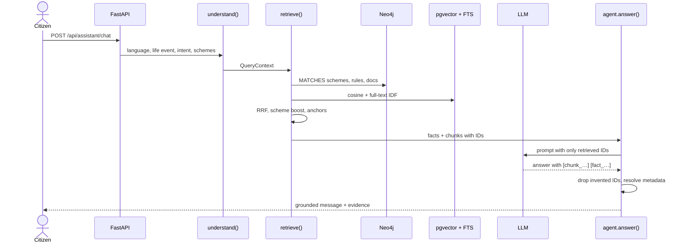

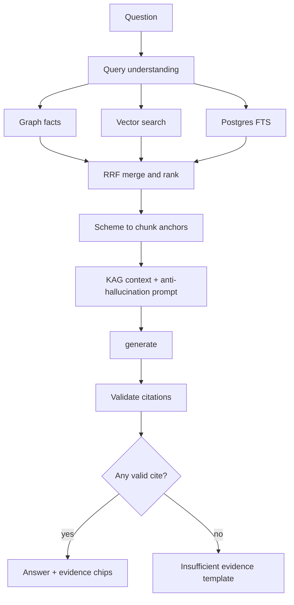

### 6.1 Query understanding

`query_understanding.py`

- Language: `en` / `hi` / `kn` from script, request, or profile.
- Retrieval language: LLM translation when available, else glossary.
- Life event from multilingual keywords on the graph.
- Intent: discover, documents, eligibility, how-to-apply, amount, why, plus small talk (greeting, thanks, about).
- Mentioned scheme names; state filter from profile (`Karnataka` → `KA`).
- Follow-ups ("how do I apply for it?") inherit the conversation's schemes (`from_context`); with one or two of them, their names are added to the retrieval query so document search finds the right text.

`agent.answer` short-circuits two cases without retrieval: small talk gets a localized template reply, and **why** (when the caller passes `previous_evidence`) restates the evidence of the last assistant message. Web chat and Telegram share this. `channel="telegram"` makes the LLM prompt and the deterministic fallback shorter (scheme details move to buttons). The deterministic fallback composes discover, documents, eligibility, amount and how-to-apply answers from graph facts plus the scheme's own linked document chunk.

### 6.2 Retrieval

`retriever.py`

- Graph: `LifeEvent-[:MATCHES]->Scheme` plus rules, documents, department, portal, state. Fact IDs like `fact_clr_r3`.
- Vectors: cosine only against chunks whose `embedding_model` matches the current model.
- Lexical: Postgres full-text, IDF re-score.
- Fusion: reciprocal rank fusion, then ranking heuristics and per-document diversity.

### 6.3 Generation and fallback

`agent.py` + `prompts.py` + `services/ai/`

- Providers: `generate`, `generate_json`, `embed`.
- `ollama.py`, `openai.py`, `kimi.py`.
- Unreachable provider + `AI_FALLBACK_ENABLED`: compose from retrieved sentences; health labels fallback.

Changing `LLM_PROVIDER` does not change the KAG steps.

---

## 7. Document ingestion

`backend/app/ingestion/`

Stages: **UPLOADED → EXTRACTING → CHUNKING → EMBEDDING → INDEXING → COMPLETE**.

| Input | Path |
|---|---|
| Admin file | `POST /api/admin/documents` — PDF, TXT, MD, HTML, DOCX |
| URL | `POST /api/admin/sources` — HTTP GET, BeautifulSoup |
| Scheme library | `scheme/<slug>/{meta.json,content.txt}` — synced in the background at startup, from **Admin → Knowledge Base → Sync**, or `python -m app.ingestion.scheme_folder [--force]`. Unchanged text is skipped; removed folders are de-indexed. |

Blocks `{text, section, page}` keep provenance through the chunker. Indexing writes Postgres chunks and links Neo4j documents when scheme aliases match (`detect_scheme_mentions`). Jobs: `BackgroundTasks` + poll `GET /api/admin/ingestion/{id}`.

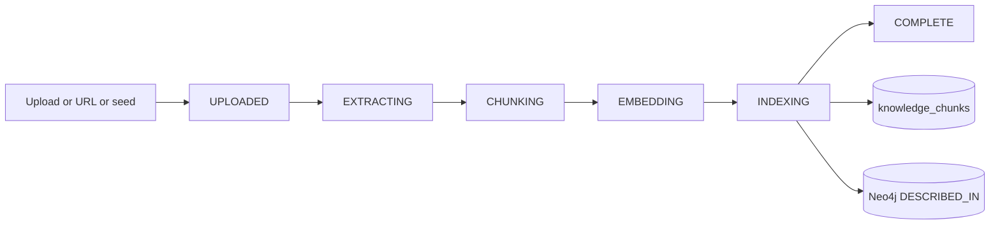

---

## 8. Screen-aware form assistance

`backend/app/services/form_assistant.py`, `/api/screen-assistance`. Form JSON: `data/seed/forms/crop_relief_form.json`.

Screen context is **not** stored as images: field labels, required flags, filled/empty, focus, buttons, warnings. A downscaled JPEG frame is sent only with messages that look like questions. It is read by `VISION_MODEL` when set; otherwise, or if vision fails, `services/ocr.py` reads it with Tesseract (`OCR_ENABLED`, `TESSERACT_CMD`; en/hi/kn) and turns detected labels and radio options into screen context. Frames are decoded in memory and discarded; only redacted text is used and only labels are persisted.

Dialogue: state machine + validators (dates, mobile, Aadhaar vs 16-digit VID, DL, IFSC, survey numbers, land units, option synonyms). Fail → LLM extract → validators again. A parsed value is only **proposed** (ID and account numbers masked); it is written to the form after an explicit yes, via **Fill field / Don't fill** or by voice, and a pending value survives a clarifying question. Where-to-find hints are cited form-guide chunks. AI notes regenerate each turn; user notes only after accept. Declaration is never auto-ticked.

Privacy: `services/redact.py` masks long numbers (Aadhaar, account numbers) to their last 4 digits and redacts OTP/PIN/CVV/password values before messages are stored by the assistant, the form assistant and the Telegram bot. The form assistant refuses OTPs and passwords as answers.

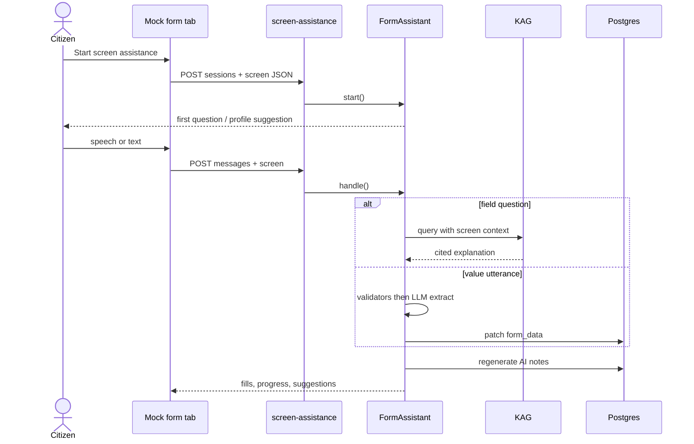

Application statuses:

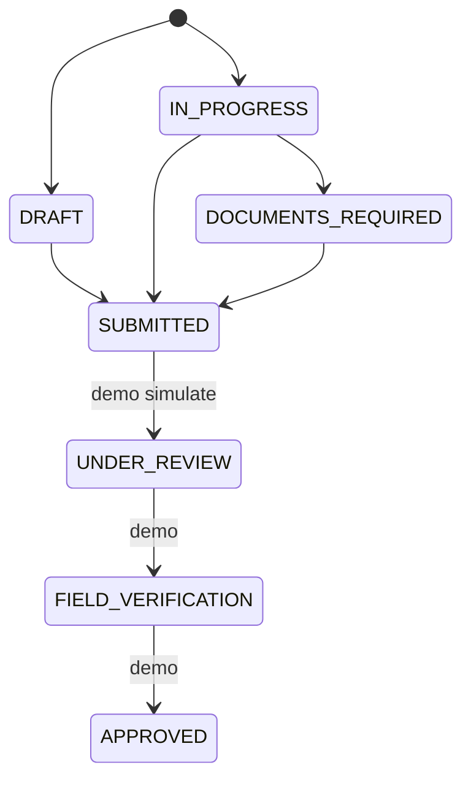

---

### 8.1 AI Form Assistant (any uploaded form)

A separate, generic path from the mock crop-relief form above: the citizen uploads their own PDF or photo, which is stored privately per user, analysed into a field schema (`form_fields`), filled through the AutoFill panel and the conversational assistant, and written to a new PDF. It reuses KAG for factual questions and the provider layer for optional type refinement. See [FORM_ASSISTANT.md](FORM_ASSISTANT.md).

## 9. AI provider layer

`backend/app/services/ai/` — callers use `get_ai()` only. `GET /api/health/ai` never returns keys.

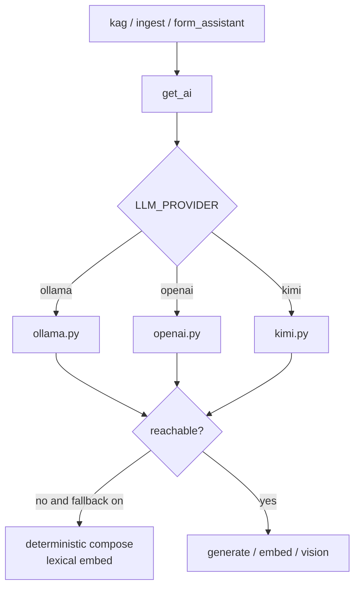

Typical Compose: `LLM_PROVIDER=ollama`, `LLM_MODEL=qwen3:8b`, `EMBEDDING_MODEL=nomic-embed-text`, `OLLAMA_BASE_URL=http://ollama:11434`.

---

## 10. Telegram bot

`backend/app/bot/`: `telegram.py` (lifespan polling), `handlers.py`, `keyboards.py`, `formatter.py`, plus `conversation.py` (users, conversations and KAG turns) and `copy.py` (multilingual text), both shared with the WhatsApp bot.

Users keyed by `telegram_id` (language preset from the Telegram client language). Empty token disables the bot; API still runs.

- Every text message runs `agent.answer(..., channel="telegram")` with the last six messages as history, the conversation's schemes as follow-up context, and the previous reply's evidence for "why" questions.
- The reply language follows the script the citizen typed (Hindi/Kannada), otherwise their `/language` choice.
- Answers carry one button per suggested scheme. A scheme button opens a card (benefit, department, portal) with **Documents / Eligibility / How to apply / Benefit** buttons, each of which asks KAG a focused question about that scheme.
- **Sources** buttons only return evidence of messages that belong to the tapping user.
- `concurrent_updates` is on so one slow LLM answer does not block other citizens; a per-user lock keeps each user's own turns in order. A typing indicator stays on while the pipeline runs, long replies are split at paragraph boundaries, and failures return a friendly message instead of silence.
- Commands: `/start`, `/help`, `/language`, `/new` (fresh conversation), `/sources`. Voice notes, photos and files get a "please type" reply.

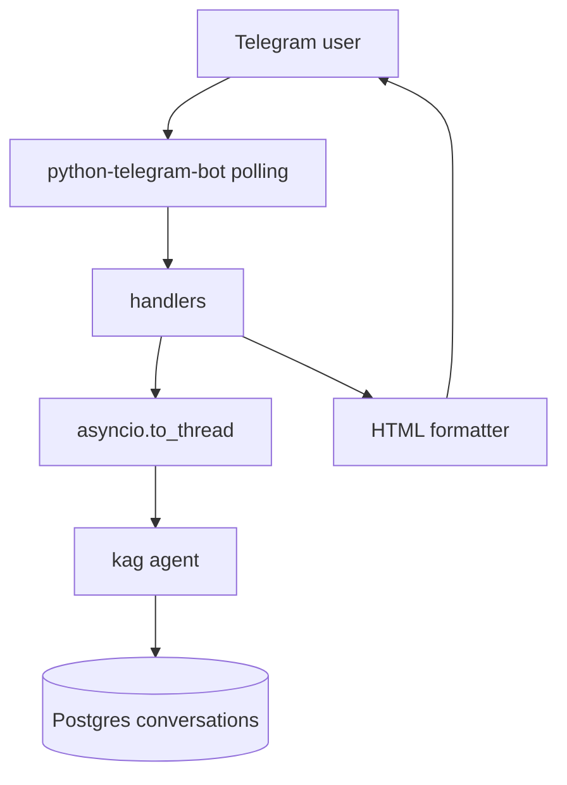

---

## 10a. WhatsApp bot

Setup: [WHATSAPP_SETUP.md](../WHATSAPP_SETUP.md). Uses the Meta WhatsApp Cloud API. Meta pushes messages to a webhook instead of the bot polling, so the webhook runs in every API replica and is independent of `RUN_BACKGROUND_TASKS`.

- `api/whatsapp.py`: `GET /api/webhooks/whatsapp` answers Meta's verify handshake (`WHATSAPP_VERIFY_TOKEN`). `POST` checks `X-Hub-Signature-256` against `WHATSAPP_APP_SECRET`, returns 200 at once and handles the payload in a `BackgroundTasks` job. The path is exempt from the API rate limiter.
- `bot/whatsapp_handlers.py`: the same flow as Telegram through `conversation.process_message(..., channel="whatsapp")`. Scheme suggestions and **Sources** are a list message, and the per-scheme **Documents / Eligibility / How to apply / Benefit** questions are a second list. Commands (`start`, `help`, `language`, `new`, `sources`, and greetings) only count when they are the whole message. Message IDs are deduplicated in memory against Meta retries.
- `bot/whatsapp_client.py`: Graph API calls for text (split at 4000 chars), reply buttons, list messages, and read receipts with a typing indicator.
- Users are keyed by `whatsapp_id` (the phone number) and conversations use `kind = "whatsapp"`. Empty `WHATSAPP_TOKEN` or `WHATSAPP_PHONE_NUMBER_ID` disables the bot.

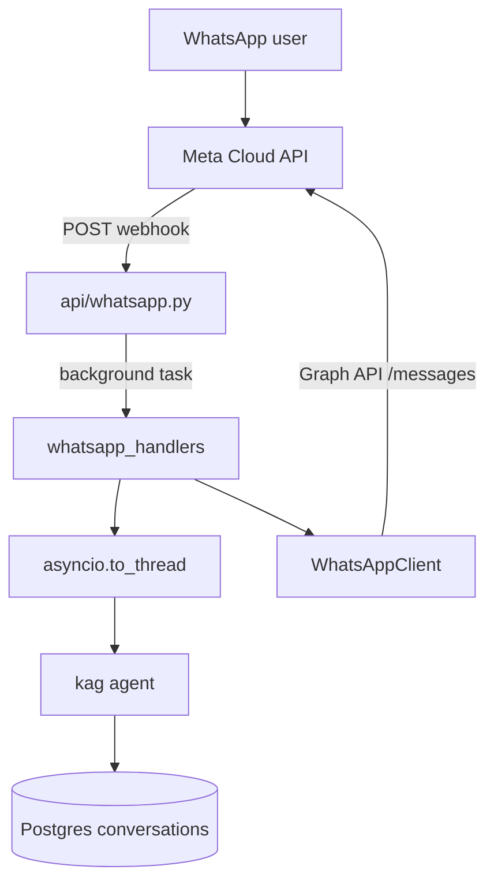

---

## 11. Auth and tenancy

- JWT HS256, `sub` = user id, role in claims, default 1440 minutes.
- `get_current_user`: Bearer required; inactive users rejected.
- `require_admin` on all `/api/admin`.
- Applications, notes, wallet, conversations scoped to `user_id`.

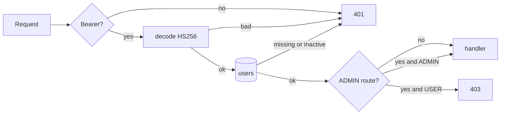

---

## 12. Optional: Whisper Chat app (offline assistant)

`whisper-chat-app/` is a separate Expo / React Native app that answers questions about the demo schemes entirely on the phone. It is **not** wired to FastAPI and needs no network after first launch (the models are downloaded once, about 3.2 GB). It needs a native dev build, not Expo Go. Details: [whisper-chat-app/README.md](../whisper-chat-app/README.md).

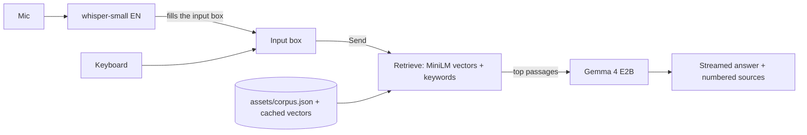

- **Models** run through `react-native-executorch`: whisper-small (speech to text), all-MiniLM-L6-v2 (embeddings) and Gemma 4 E2B (answers).
- **Knowledge base** is `assets/corpus.json`, generated by `scripts/build_corpus.py` from `data/documents`, `data/seed/graph.json` and `data/seed/forms`. It never reads `data/users`. Passages are embedded once on the device and the vectors are cached; a fingerprint of the corpus triggers re-indexing when it changes.
- **Retrieval** fuses vector similarity with keyword matching (reciprocal rank fusion). Passages that are neither close in meaning nor share a keyword are dropped, so an off-topic question gets no sources and the model says it cannot verify.
- **Generation** runs each question from an empty context (`src/rag/answerSession.ts`): system prompt, this question's passages, the question. Old passages never pile up in the context window.
- **Input** is one path: typed and spoken questions both go through `submit`. Voice only fills the input box and nothing is sent until the user taps Send.

This is a smaller, separate implementation and not the backend's KAG pipeline: there is no Neo4j graph, and the model is asked to cite passages as `[1]`, `[2]` but the app does not validate those citations the way the backend does (it shows the numbered passages that were sent).

---

## 13. Citizen and admin journeys

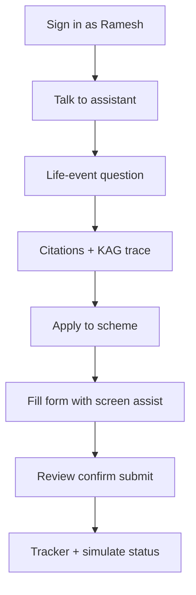

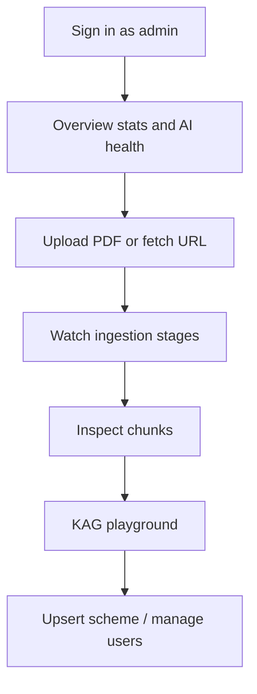

### Citizen walkthrough

1. Sign in as **Ramesh**, then open **Talk to Assistant**.
2. Say or type: *"Heavy rain destroyed my crop. What help can I get?"* This also works in Hindi or Kannada: switch the language, then press the mic.
3. The assistant detects the life event **Crop Damage**, retrieves the linked schemes from Neo4j plus document evidence, and answers with numbered citation chips. **Sources used** shows each evidence chunk (publisher, document, section, URL, retrieval method, content hash); **How this answer was grounded** shows each KAG step.
4. Ask *"Why did you tell me this?"*. The assistant lists the exact sources behind its previous answer.
5. Choose **Apply** on *Crop Damage Assistance* to open the mock government form.
6. Click **Help Me Fill This Form**, then **Start Screen Assistance** (pick *This tab* in the share dialog). A "Screen sharing active" indicator with **Stop Sharing** and a preview of what the AI sees stays visible.
7. Talk naturally:
   - *"yes"* accepts a profile suggestion or approves a proposed value (**Fill field**).
   - *"What should I put here?"* explains the current or focused field, with evidence.
   - *"Aadhaar"* answers which ID you have; the next field becomes *Aadhaar number*.
   - *"I don't know"* marks the field for later and suggests a note you can add to **My notes**.
   - *"Where do I find the IFSC?"*, *"change the address"*, *"2 acres 20 guntas"*, *"yesterday"*, *"heavy rain"* also work.
8. Watch the form fill, the progress panel update and the **AI notes** refresh. The assistant never ticks the declaration box.
9. At 100%, open **Review**, check every answer, confirm and submit (demo). The application appears in **Applications** with a timeline, evidence and the conversation. Try **Simulate status update**.
10. Leave the form part-way and come back later. The assistant resumes with: *"You were filling … We completed your … The next section requires your …"*

### Admin walkthrough ("the system is not hard-coded")

1. Sign in as **Admin**. **Overview** shows knowledge-base stats, AI provider status and the ingestion pipeline.
2. **Knowledge Base → Upload document**: upload `data/documents/hailstorm-guidance-note-DEMO.pdf` (or `crop-damage-field-survey-advisory-DEMO.md`) and watch Uploaded → Extracting → Chunking → Embedding → Indexing → Complete.
3. **View chunks + metadata** shows each chunk with its provenance JSON.
4. In the **KAG retrieval playground**, ask *"What should I do after hailstorm damage? Can I clear the field?"*. Evidence from the new document appears in the answer, and citizens asking the same question now get it too.
5. **Sources → Fetch & index** fetches, cleans, chunks, embeds and indexes an official web page URL.
6. **Schemes** shows the Neo4j graph per scheme (life event → scheme → rules / documents / department / portal) and a form for adding schemes. **Users** lets you search, change roles and disable accounts.

---

## 14. Design constraints (prototype)

- No Celery and no Telegram webhooks. Production runs several stateless API replicas plus one worker for the bot and re-embedding; ingestion jobs still run in the process that received the upload.
- No SSO, no production secrets manager, no audit product.
- Seed data is crop-loss / Karnataka-oriented; **pipeline** is generic: new schemes and documents go through admin APIs, not code changes.
