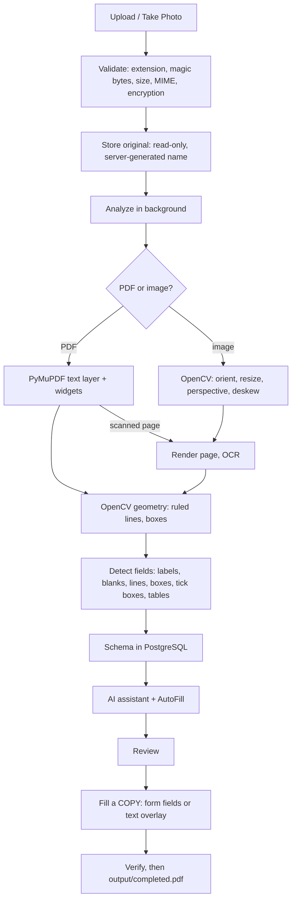

# AI Form Assistant

A citizen uploads **any** form (PDF, JPG/PNG/WebP, or a camera photo). Nothing is hard-coded: the app reads the document, detects its fields, guides the citizen through them, and produces a completed PDF. The original upload is never modified.

Companion docs: [README](../README.md), [ARCHITECTURE](ARCHITECTURE.md), [API](API.md#ai-form-assistant--apiforms).

---

## 1. Flow



## 2. Private storage

```
<FORMS_DIR>/<user_id>/forms/<form_id>/
    original/original.pdf|jpg|png|webp   written once (exclusive create), chmod 0400
    processed/page-001.png ...            derived page images (used for preview / photo-based output)
    output/completed.pdf                  generated result
```

* Paths are built only from server-generated hex IDs and checked to stay inside the storage root; the uploaded filename is display-only.
* `FORMS_DIR` is not served by nginx or any static route. Files are reachable only through authenticated API routes.
* Deleting a form moves its folder aside (atomic rename), deletes the rows in one transaction, then purges the folder. If the database step fails the folder is restored. Leftover `.trash-*` folders are swept on the next delete.
* Back up the `userforms` volume in production.

## 3. Ownership

Every table (`forms`, `form_pages`, `form_fields`, `form_values`, `form_assistance_sessions`, `form_notes`) has a `user_id`. Every route resolves the form with `WHERE id = :id AND user_id = :me`; someone else's form is a plain 404 (no existence leak). Covered by `tests/test_forms.py::TestIsolation`.

## 4. Detection (no custom models)

| Signal | Source |
|---|---|
| Text + boxes | PyMuPDF words (digital PDFs); Tesseract (scans, photos) |
| Fillable fields | PyMuPDF widgets (`source: acroform`, confidence 0.98) |
| Ruled lines, rectangles, tick boxes | OpenCV morphology + contours on the rendered page |
| Photo clean-up | EXIF orientation, resize, document outline → perspective warp, deskew, denoise/threshold for OCR |

Rules (see `services/formdoc/detect.py`): a field is only produced when the page shows evidence — a blank (`____`, `__/__/____`) or ruled line next to a label, a rectangle beside/below a label, tick boxes grouped into a choice, a table whose header row sits above empty cells, or a `Label:` followed by open space (low confidence, flagged). Nothing is invented. Types are inferred from labels (date, phone, Aadhaar/PAN, IFSC, account, PIN code, …). Signature areas are never filled. If `FORM_LLM_ENABLED`, the configured LLM may correct the *type* of ambiguous text fields, using labels only.

Known limits: tables are recognised only when drawn as a cell grid; multi-page sections are treated page by page; radio circles are recognised only when the form uses glyphs (○) or fillable radio buttons; handwriting is not read.

## 5. Assistant

* Answers to a field are validated by code (`values.py`) — the LLM never sees what the citizen types as a value. Only redacted question text and field labels go to KAG/LLM; long numbers are masked.
* OTP / password / PIN messages are refused and not stored; fields with such labels are never collected.
* Ambiguity is never resolved silently: “I have both” on a one-of choice, or “same as before” when several earlier addresses exist, produces a question.
* Every factual answer separates **FORM OBSERVATION** (from this document) from **KNOWLEDGE BASE INFORMATION** (existing KAG pipeline, cited). Without evidence: *“I couldn't verify this from the uploaded form or available official sources.”*
* The stored chat transcript contains no entered values.
* Screen assistance uses `getDisplayMedia`, a clear indicator and **Stop Assistance**; one JPEG frame is sent only with a question, read in memory (vision model or Tesseract) and discarded.

## 6. Generating the PDF

* Fillable PDFs: the real fields are set.
* Other PDFs: text is overlaid at the detected coordinates, ticks are drawn in the option boxes; original content is not rasterised.
* Photos: the corrected page image becomes a one-page PDF, with the same overlay.
* Required fields must be filled, or the citizen must explicitly tick “leave these blank”.
* The output is written to a temp file, re-opened, page-count checked and only then moved to `completed.pdf`. The original's SHA-256 is verified before and after.
* Text in non-Latin scripts needs a Unicode font (`FORM_FONT_PATH` or a system Noto/DejaVu font); otherwise that field is reported as not written.

## 7. Configuration

| Variable | Default | Purpose |
|---|---|---|
| `FORMS_DIR` | `./data/users` | Private storage root (`/data/users` in Docker) |
| `MAX_FORM_SIZE_MB` | `25` | Upload limit |
| `MAX_FORM_PAGES` | `40` | PDF page limit |
| `FORM_LLM_ENABLED` | `true` | LLM refinement of field types (labels only) |
| `FORM_FONT_PATH` | empty | TTF for Hindi/Kannada text in filled PDFs |

Rate limits: `forms/upload`, `analyze`, `generate` use the `upload` rule; `assistant` uses the `ai` rule.

## 8. Tests

```bash
cd backend && pip install -r requirements.txt -r requirements-dev.txt
python -m pytest tests -q        # SQLite + temp storage; no Postgres, Neo4j, Ollama or Docker needed
```

Covers upload validation, PDF and photo pipelines, fillable PDFs, rotated pages, byte-for-byte original preservation, two-user isolation, notes separation, delete lifecycle and the assistant's clarification / privacy rules. OCR itself (Tesseract) is stubbed in the photo test; run the app with Tesseract installed (the Docker image has it) to exercise real OCR.
